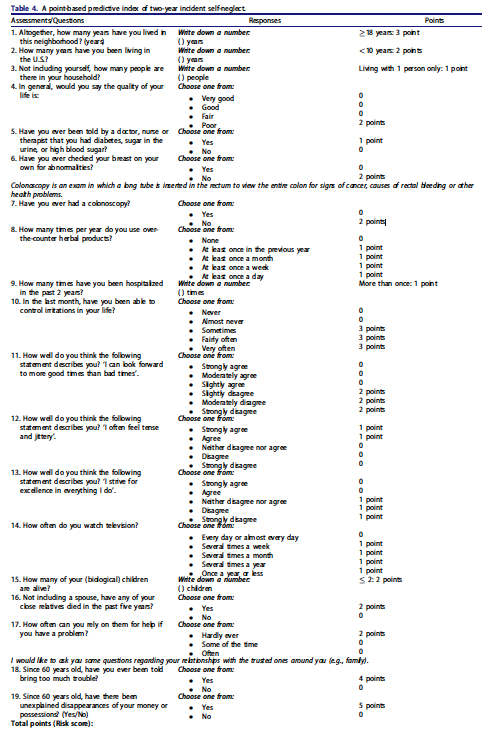

# Development and validation of a predictive index of elder self-neglect risk among a Chinese population

# Background 

Elder self-neglect occurs when an older adult’s inability to perform essential self-care tasks—such as maintaining food, shelter, medical care, or financial affairs—threatens their health and safety. It leads to mental disorders, increased premature mortality, and higher healthcare utilization.

Currently, diagnosing self-neglect requires in-home assessments, which are impractical for clinicians who frequently interact with at-risk older adults. By the time self-neglect is identified, cases are often severe, costly, and resistant to treatment. Therefore, an early detection risk index is crucial for predicting and intervening self-neglect.

# Project goal

Our goal was to develop a **simple point-based predictive index** to estimate risk prognostication of self-neglect onset. 

# Methods

The study analyzed longitudinal data from 2,713 participants in the Population Study of Chinese Elderly (PINE), collected in Chicago (2011–2015) with ~2-year follow-up intervals. The primary outcome was incident self-neglect. Fourteen potential predictive domains were examined, including sociodemographics, neighborhood/community, immigration, adverse life events, culture, general wellbeing, lifestyle, medical health, health care utilization, physical function, cognitive function, social wellbeing, violence, and psychological wellbeing. Stepwise selection in multivariable logistical regression models and bootstrapping were used to develop and validate the predictive index. 

# Results 

We developed a 19-item risk index with a c-statistic of 0.74 and validated it using 100 bootstrapped samples, yielding a corrected accuracy of 0.68. The point-based index ranges from 0 to 37 and estimates the probability of self-neglect onset within two years.

### Point-based index

### Risk Score Interpretation

| Score Range | Probability of Self-Neglect Onset (%) |
|------------|--------------------------------------|
| 0 - 9      | <10%                                |
| 10 - 13    | 10% - 30%                           |
| 14 - 17    | 31% - 60%                           |
| 18 - 22    | 61% - 90%                           |
| 23 - 37    | >90%                                |

 

